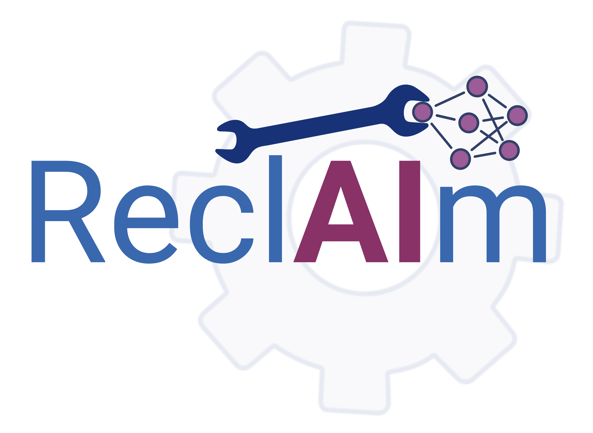

  

A multi-agent system designed to evaluate the performance of medical image classification models, identify model degradation, and, when required, initiate fine-tuning procedures to restore accuracy.

---

### 📚 Cite this work

If you use **ReclAIm** in your research, please cite:

>Eleftherios Tzanis, Michail E. Klontzas (2026). ReclAIm: A multi-agent framework for degradation-aware performance tuning of medical imaging AI
